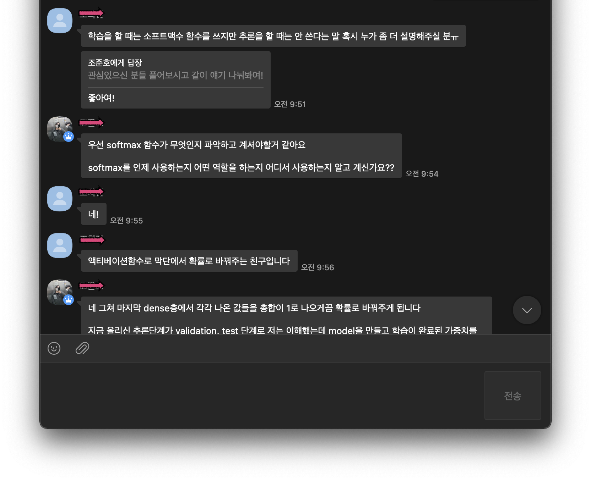

## 소프트맥스란
소프트맥스는 활성함수 중 하나로 다중 카테고리 분류 문제에 쓰인다. Softmax와 Sigmoid 모두 모델의 출력값을 0과 1사이의 값으로 뱉기 때문에 우리는 이걸 확률값으로 해석할 수 있다. Sigmoid는 맞냐/아니냐를 뜻하는 이진 분류 문제에 사용된다. 1이면 맞고 0이면 아니다. Softmax는 k개의 클래스에 해당하는 확률값을 뱉는다. k1에 0.1 k2에 0.2 k3에 0.7, 이런 식이다. Softmax로 계산한 확률값들의 총합은 항상 1이다(당연히). Softmax/Sigmoid의 예측 확률값과 실제값을 Cross Entropy 함수에 먹여서 Loss를 계산할 수 있다. 

```python
def softmax(p): return np.exp(p) / np.sum(np.exp(p))
def sigmoid(p): return 1 / (1 + np.exp(-p))

In [160]: softmax([0.2, 1.5, -2])
Out[160]: array([0.20920065, 0.76761926, 0.02318009])

In [163]: sigmoid(0.2)
Out[163]: 0.549833997312478
```

## 크로스 엔트로피란
엔트로피란 정보 이론에서 불확실성의 척도다. 소프트맥스나 시그모이드를 사용하여 모델의 출력값을 확률값으로 바꿔주면 크로스 엔트로피를 이용하여 Loss를 계산할 수 있다. 이 말은 모델이 학습 할 수 있는 환경(경사)를 만든다 뜻이다. 이 설명만으로 소프트맥스의 역할에 대해 충분하지만, 소프트맥스를 왜 추론에 쓰지 않는 이유는 크로스 엔트로피에 달려 있다.

통계에서 불확실성(Uncertainty)이란 어떤 사건 P가 얼마나 예측하기 힘든지를 말한다. 엔트로피(Entropy)는 그 불확실성을 계산하기 위한 방법이다. 상자 안에 빨간 공과 검은 공이 5:5로 있는 경우와, 2:8로 있는 경우의 엔트로피를 계산 말고 생각해보자. 5:5의 경우에는 무엇이 나올지 예측하기가 어렵다. 2:8의 경우에는 아마 8에 해당하는 검은 공이 나올 것으로 예측할 수 있다. 이렇게 **예측하기 쉬운 일에서 엔트로피는 낮아진다.**

```python
def entropy(p): return -np.sum(p * np.log(p))

In [155]: entropy([0.5, 0.5])
Out[155]: 0.6931471805599453

In [156]: entropy([0.2, 0.8])
Out[156]: 0.5004024235381879
```

크로스 엔트로피는 사건 P와 그에 대한 예측인 Q의 차이를 계산한다. 예측 모델이 실제 사건 P의 확률 분포와 일치할수록 그 값은 작아진다. **머신러닝에서 크로스 엔트로피를 사용하여 예측값과 실제값의 차이를 계산한다**. 예를 들어 다중 분류 문제에서 정답 데이터 y는 `[0, 0, 1]`과 같이 원핫인코딩 된 벡터다. 이는 이미지의 레이블이 개, 고양이, 오리 중 오리일 확률이 100%라는 뜻이다.  모델의 예측값은 `[0.2, 0.1, 0.7]`와 같은 형태다. 두 확률의 차이를 크로스 엔트로피로 계산하면 0.35가 나온다. 모델의 학습이란 크로스 엔트로피를 Loss 값으로 삼고 최소화하도록 가중치를 갱신하는 것이다. 이를 통해 실제 확률과 예측 확률 모델을 최대한 비슷하게 만든다.

```python
def cross_entropy(target, prediction): return -np.sum(target * np.log(prediction))

In [183]: cross_entropy([0, 0, 1], [0.2, 0.1, 0.7])
Out[183]: 0.35667494393873245
```

## 소프트맥스를 추론할 때 쓰지 않는 이유
크로스 엔트로피는 두 확률값의 차이를 구하는 것이다. 딥러닝에서는 모델의 출력값을 소프트맥스를 통해 확률값으로 바꿔 실제 확률과의 차이를 구한다. 따라서 모델의 추론 과정에서 소프트맥스를 쓰는 것은 문제에 대해 자기가 예측값을 냈고, 그 값이 얼마나 맞을 것 같은지를 구하는 일이다. 이 과정은 학습할 때는 필요하지만 정답이 없는 추론 과정에서는 할 필요가 없다. 그냥 모델의 출력값 중 가장 높은 값이 무엇인지만 알면 된다.

```python
p = [-0.15, -0.87, 1.1]

In [216]: np.argmax(p)
Out[216]: 2
```

## 소프트맥스를 쓰면 안될 때
추론 과정 외에도 소프트맥스를 사용하면 안되는 경우가 있다. 소프트맥스는 k개의 분류에 대한 상대적인 확률을 계산한다. 소프트맥스값이 `[0.2, 0.1, 0.7]`이라면 개, 고양이, 오리 중에 (개, 고양이)가 아니고 오리일 확률이 70%라는 것이다. 따라서 분류에 속하지 않는 데이터(코끼리)라도 셋 중에 하나일 확률로 값을 변환하며 그 총합은 항상 1이 된다. 모델이 코끼리를 미확인 물체 X로 분류하는 게 아니라 뭐 모르겠지만 우선 오리로 예측한다는 뜻이다. 미확인 물체 X의 존재를 모델에게 염두에 두게 하기 위해선 상대적인 확률을 계산하는 소프트맥스가 아닌 각각의 범주에 대해 맞는지 아닌지를 계산하는 시그모이드를 써야 한다. 범주에 속하지 않는다면 예측의 총합이 1보다 작을 수도 있어야 한다는 뜻이다. 그리고 이 때는 바이너리 크로스 엔트로피 값을 사용하여 Loss를 계산한다. 

```python
def binary_cross_entropy(target, prediction):
	  term1 = target * np.log(prediction) # 실제값(target)이 1일 때
    term2 = (1-target) * np.log(1 - prediction) # 실제값이 0일 때
    return -np.sum(term1 + term2)

target = [0, 0, 1]
prediction = [-.15, -.87, 1.1]
sigmoid_prediction = [sigmoid(p) for p in prediction]

In [249]: [binary_cross_entropy(t, p) for t, p in zip(target, sigmoid_prediction)]
Out[249]: [0.620957047789532, 0.34991825330155735, 0.2873353251154307]
```

## References 
- [A Gentle Introduction to Cross-Entropy for Machine Learning](https://machinelearningmastery.com/cross-entropy-for-machine-learning/)
- [Cross-entropy 의 이해: 정보이론과의 관계 :: Deep Play](https://3months.tistory.com/436)
- [Nothing but NumPy: Understanding & Creating Binary Classification Neural Networks with Computational Graphs from Scratch | by Rafay Khan | Towards Data Science](https://towardsdatascience.com/nothing-but-numpy-understanding-creating-binary-classification-neural-networks-with-e746423c8d5c)